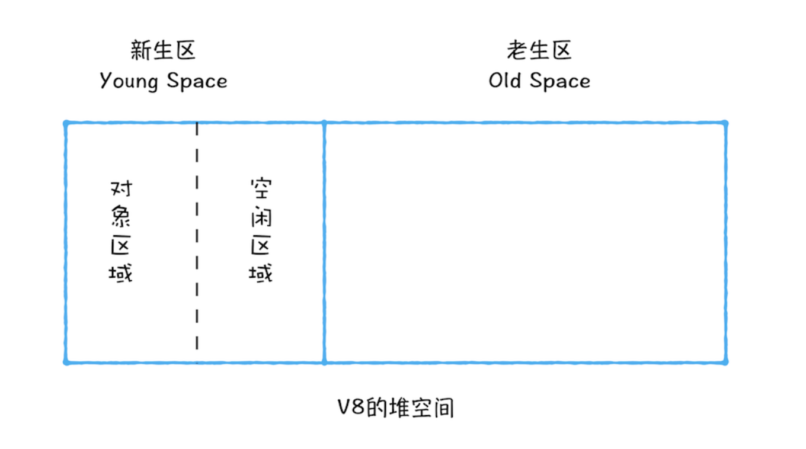

## 垃圾回收
#### 不同语言的垃圾回收策略
垃圾数据回收分为**手动回收**和**自动回收**两种策略

**手动回收**: 何时分配内存、何时销毁内存都是由代码控制的
**自动回收**: 产生的垃圾数据是由垃圾回收器来释放的

#### 调用栈中的数据是如何回收的
```js
  function foo {
    var a = 1
    var b = { name: '小明' }
    function showName {
      var c = 'string'
      var d =  { name: '小红' }
    }
    showName()
  }
  foo()
```
foo( )执行完之后其执行上下文就会被销毁
销毁流程如下:
  + 先创建foo的执行上下文 EC(FOO)
  + 执行到 showName() 创建其 showName的上下文 EC(SHOW)
  + 这是调用栈分别有三个上下文 [ EC(G), EC(FOO), EC(SHOW) ]
  + 此时还有一个记录当前**执行状态的指针（称为 ESP）**,指向EC(SHOW)
  + 当showName执行完成之后
  + ESP  指向了 EC(FOO)
  + ***这个下移操作就是销毁 showName 函数执行上下文的过程***

  **为什么下移指针的操作就是销毁showName上下文的过程?**

  当 showName 函数执行结束之后，ESP 向下移动到 foo 函数的执行上下文中，上面 showName 的执行上下文**虽然保存在栈内存中，但是已经是无效内存了**。比如当 foo 函数再次调用另外一个函数时，这块内容会被**直接覆盖掉**，用来存放另外一个函数的执行上下文
  所以说，**当一个函数执行结束之后，JavaScript 引擎会通过向下移动 ESP 来销毁该函数保存在栈中的执行上下文**

#### 堆中的数据是如何回收的
上面例子中 声明 foo 和showName 的时候分别在堆内存中占用了两块地址,虽然对应的执行上下文处于无效状态, 但是保存在堆内存中的2个对象依然占用着空间
**要回收堆中的垃圾数据，就需要用到 JavaScript 中的垃圾回收器了**

#### 代际假说和分代收集
**代际假说**
  这是垃圾回收领域中一个重要的术语,后续垃圾回收的策略都是建立在该假说的基础之上的.
  有以下两个特点
  + 大部分对象在内存中存在的时间很短，简单来说，就是很多对象一经分配内存，很快就变得不可访问
  + 不死的对象，会活得更久

在 V8 中会把堆分为**新生代**和**老生代**两个区域，新生代中存放的是生存时间短的对象，老生代中存放的生存时间久的对象

**副垃圾回收器，主要负责新生代的垃圾回收**

**主垃圾回收器，主要负责老生代的垃圾回收**


#### 垃圾回收器的工作流程
不论什么类型的垃圾回收器，它们都有一套共同的执行流程：
  + 标记空间中活动对象和非活动对象
    `所谓活动对象就是还在使用的对象，非活动对象就是可以进行垃圾回收的对象`
  + 回收非活动对象所占据的内存
    `其实就是在所有的标记完成之后，统一清理内存中所有被标记为可回收的对象`
  + 内存整理
    `一般来说，频繁回收对象后，内存中就会存在大量不连续空间，我们把这些不连续的内存空间称为「内存碎片」。当内存中出现了大量的内存碎片之后，如果需要分配较大连续内存的时候，就有可能出现内存不足的情况。所以最后一步需要整理这些内存碎片，但这步其实是可选的，因为有的垃圾回收器不会产生内存碎片`

#### 副垃圾回收器
副垃圾回收器主要负责新生区的垃圾回收。而通常情况下，大多数小的对象都会被分配到新生区，所以说这个区域虽然不大，但是垃圾回收还是比较频繁的

新生代中用**Scavenge算法**来处理。所谓 Scavenge 算法，是把新生代空间对半划分为两个区域，一半是对象区域，一半是空闲区域



新加入的对象都会存放到对象区域，当对象区域快被写满时，就需要执行一次垃圾清理操作

在垃圾回收过程中，首先要对对象区域中的垃圾做标记；标记完成之后，就进入垃圾清理阶段，副垃圾回收器会把这些存活的对象复制到空闲区域中，同时它还会把这些对象有序地排列起来，所以这个复制过程，也就相当于完成了内存整理操作，复制后空闲区域就没有内存碎片了


完成复制后，对象区域与空闲区域进行角色翻转，也就是原来的对象区域变成空闲区域，原来的空闲区域变成了对象区域。这样就完成了垃圾对象的回收操作，同时这种**角色翻转的操作还能让新生代中的这两块区域无限重复使用下去**


由于新生代中采用的 Scavenge 算法，所以每次执行清理操作时，都需要将存活的对象从对象区域复制到空闲区域。但复制操作需要时间成本，如果新生区空间设置得太大了，那么每次清理的时间就会过久，所以**为了执行效率，一般新生区的空间会被设置得比较小**

也正是因为新生区的空间不大，所以很容易被存活的对象装满整个区域。为了解决这个问题，JavaScript 引擎采用了**对象晋升策略**，也就是经过两次垃圾回收依然还存活的对象，会被移动到老生区中。

#### 主垃圾回收器

主垃圾回收器主要负责老生区中的垃圾回收。除了新生区中晋升的对象，**一些大的对象会直接被分配到老生区**。因此老生区中的对象有两个特点
  + 一个是对象占用空间大
  + 对象存活时间长

由于老生区的对象比较大，若要在老生区中使用 Scavenge 算法进行垃圾回收，复制这些大的对象将会花费比较多的时间，从而导致回收执行效率不高，同时还会浪费一半的空间。因而，主垃圾回收器是采用 **标记 - 清除(Mark-Sweep)** 的算法进行垃圾回收的

```js
  function foo {
    var a = 1
    var b = { name: '小明' }
    function showName {
      var c = 'string'
      var d =  { name: '小红' }
    }
    showName()
  }
  foo()

  /**
   * 在showName()还未执行完
   * 堆内存(heap)内部存储2个引用数据
   * heap => { 0x000: { name: '小明' }, 0x001: { name: '小红' } }
   * 调用栈(stack) 存储着三个执行上下文
   * call stack => [ EC(G), EC(FOO), ESP => EC(SHOWNAME) ]
   * showName()执行完成之后
   * ESP执行状态指针 在执行栈向下移动
   * 指向EC(FOO)   销毁EC(SHOWNAME)
   * call stack => [ EC(G), ESP => EC(FOO) ]
   * showName 函数执行退出之后
   * 遍历调用栈 发现在EC(FOO)内部还在引用 0x000,  0x001 未被引用
   * 这时候回标记 0x000 为活动对象 0x001会被标记为垃圾数据 
  */
```


上面的标记过程和清除过程就是标记 - 清除算法，不过对一块内存多次执行标记 - 清除算法后，会产生大量不连续的内存碎片。而碎片过多会导致大对象无法分配到足够的连续内存，于是又产生了另外一种算法——**标记 - 整理（Mark-Compact）**，这个标记过程仍然与标记 - 清除算法里的是一样的，但后续步骤不是直接对可回收对象进行清理，而是让所有存活的对象都向一端移动，然后直接清理掉端边界以外的内存


#### 全停顿

 V8 是使用副垃圾回收器和主垃圾回收器处理垃圾回收的，不过由于JavaScript 是运行在主线程之上的，一旦执行垃圾回收算法，都需要将正在执行的JavaScript 脚本暂停下来，待垃圾回收完毕后再恢复脚本执行。我们把这种行为叫做**全停顿（Stop-The-World）**
 

 全停顿在 V8 新生代的垃圾回收中，因其空间较小，且存活对象较少，所以全停顿的影响不大，但老生代就不一样了,如果在执行垃圾回收的过程中，占用主线程时间过久,这将会造成页面的卡顿现象.

 为了降低老生代的垃圾回收而造成的卡顿，V8 将标记过程分为一个个的子标记过程，同时让垃圾回收标记和 JavaScript 应用逻辑交替进行，直到标记阶段完成，我们把这个算法称为**增量标记（Incremental Marking）算法**
 
 

 使用增量标记算法，可以把一个完整的垃圾回收任务拆分为很多小的任务，这些小的任务执行时间比较短，可以穿插在其他的 JavaScript 任务中间执行，这样当执行上述动画效果时，就不会让用户因为垃圾回收任务而感受到页面的卡顿了