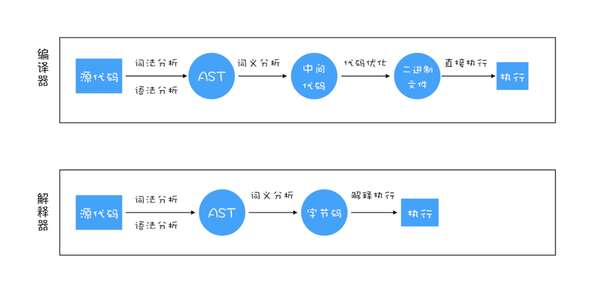
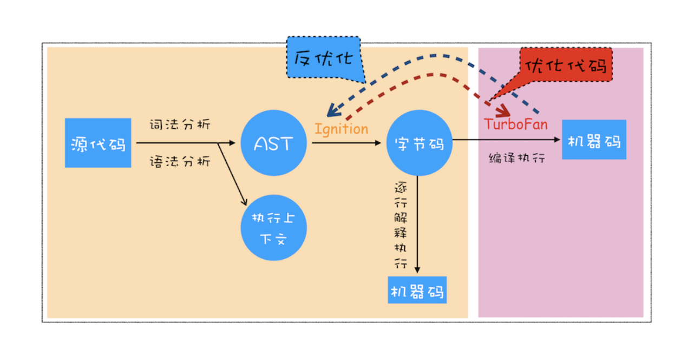
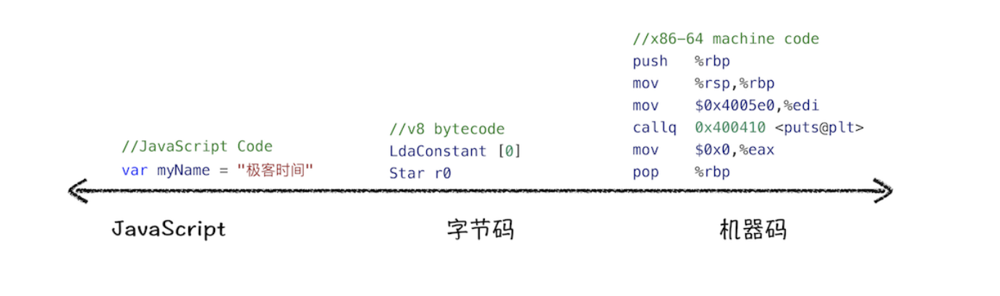
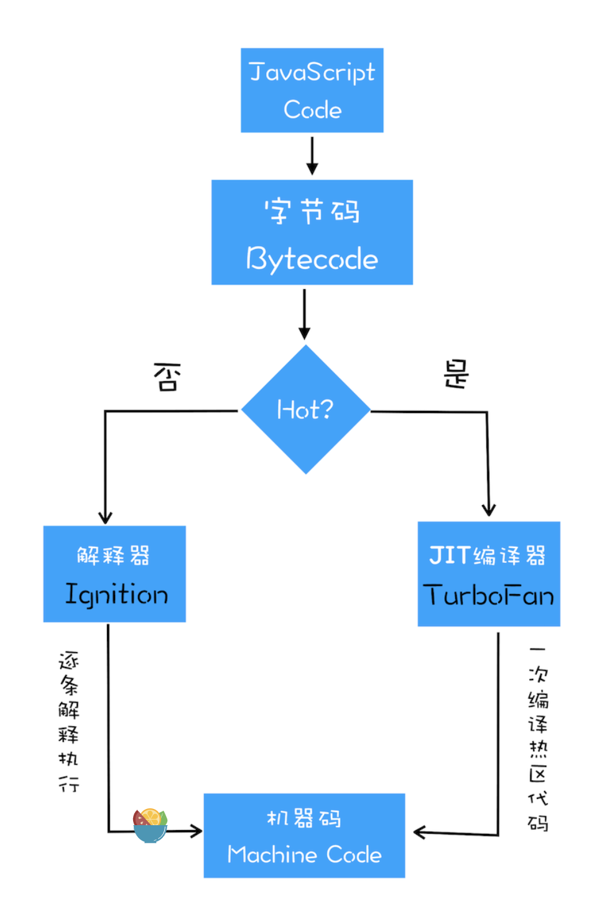

## 编译器和解释器

#### 编译器和解释器
**编译型语言**
编译型语言在程序执行之前，需要经过编译器的编译过程，并且编译之后会直接保留机器能读懂的二进制文件，这样每次运行程序时，都可以直接运行该二进制文件，而不需要再次重新编译了
如 C/C++、GO 等都是编译型语言

**解释型语言**
解释型语言编写的程序，在每次运行时都需要通过解释器对程序进行动态解释和执行
Python、JavaScript 等都属于解释型语言



#### V8 是如何执行一段 JavaScript 代码的



 1. **生成抽象语法树（AST）和执行上下文**
  `将源代码转换为抽象语法树，并生成执行上下文，而执行上下文主要是代码在执行过程中的环境信息
  AST 的结构和代码的结构非常相似，其实你也可以把 AST 看成代码的结构化的表示`
  AST需要经过2个阶段:

    1. 分词-tokenize(词法分析)
    其作用是将一行行的源码拆解成一个个token。所谓token，指的是语法上不可能再分的、最小的单个字符或字符串
    ```js
      var name = "小明"
      // var | name | = | 小明
      // 这四个都是token 分别代表的属性不一样
    ```

    2. 解析-parse(语法解析)
    其作用是将上一步生成的 token 数据，根据语法规则转为 AST。如果源码符合语法规则，这一步就会顺利完成。但如果源码存在语法错误，这一步就会终止，并抛出一个“语法错误”。
    有了 AST 后，那接下来 V8 就会生成该段代码的执行上下文

  2. **生成字节码**
  有了 AST 和执行上下文后，那接下来的第二步，解释器 Ignition 就登场了，它会根据 AST生成字节码，并解释执行字节码
  其实一开始 V8 并没有字节码，而是直接将 AST 转换为机器码，由于执行机器码的效率是非常高效的，所以这种方式在发布后的一段时间内运行效果是非常好的。但是随着Chrome 在手机上的广泛普及，特别是运行在 512M 内存的手机上，内存占用问题也暴露出来了，因为**V8 需要消耗大量的内存来存放转换后的机器码**。为了解决内存占用问题，**V8 团队大幅重构了引擎架构，引入字节码，并且抛弃了之前的编译器**，最终花了将进四年的时间，实现了现在的这套架构
  **字节码就是介于 AST 和机器码之间的一种代码。但是与特定类型的机器码无关，字节码需要通过解释器将其转换为机器码后才能执行**
  

3. **执行代码**
通常,如果有一段第一次执行的字节码，解释器 Ignition 会逐条解释执行。在执行字节码的过程中，如果发现有热点代码（HotSpot），**比如一段代码被重复执行多次，这种就称为热点代码，那么后台的编译器 TurboFan 就会把该段热点的字节码编译为高效的机器码**，然后当再次执行这段被优化的代码时，只需要执行编译后的机器码就可以了，这样就大大提升了代码的执行效率
其实字节码配合解释器和编译器是最近一段时间很火的技术，比如 Java 和 Python 的虚拟机也都是基于这种技术实现的，我们把这种技术称为**即时编译（JIT）**。具体到 V8，就是指解释器 Ignition 在解释执行字节码的同时，收集代码信息，当它发现某一部分代码变热了之后，TurboFan 编译器便闪亮登场，把热点的字节码转换为机器码，并把转换后的机器码保存起来，以备下次使用


#### JavaScript 的性能优化
+ 提升单次脚本的执行速度，避免 JavaScript 的长任务霸占主线程，这样可以使得页面快速响应交互；
+ 避免大的内联脚本，因为在解析 HTML 的过程中，解析和编译也会占用主线程；
+ 减少 JavaScript 文件的容量，因为更小的文件会提升下载速度，并且占用更低的内存。