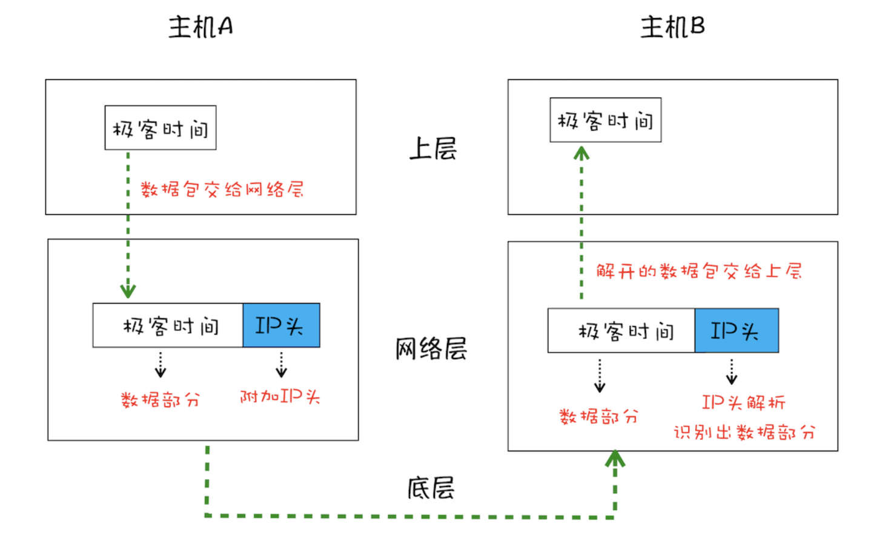
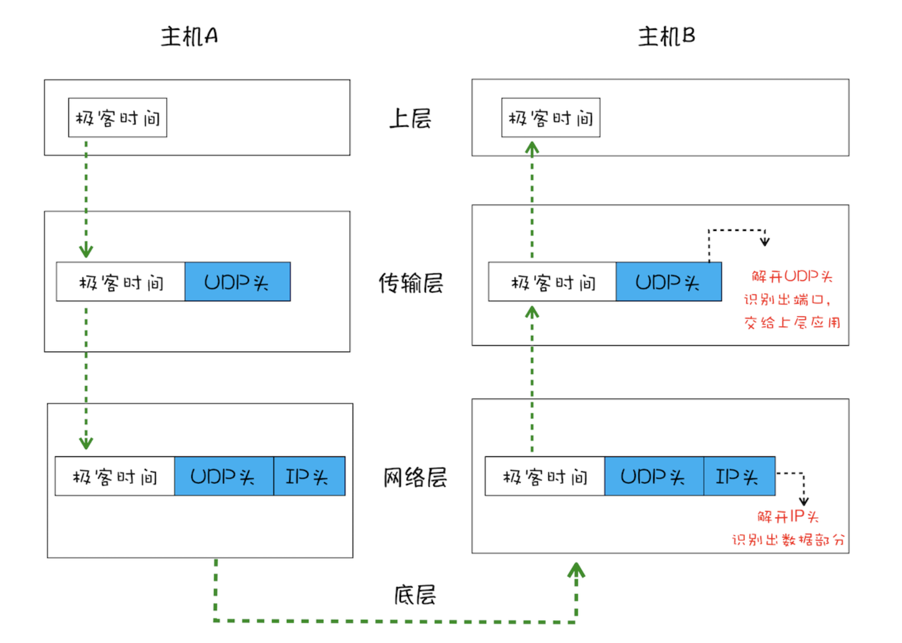
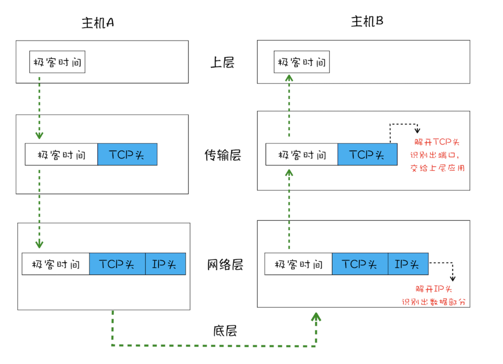
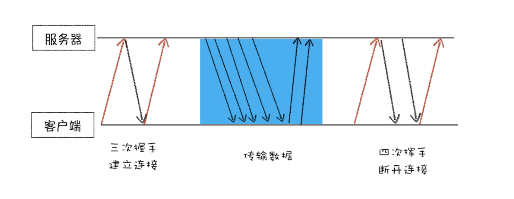

## TCP协议
互联网中的数据是通过数据包来传输的。如果发送的数据很大，那么该数据就会被拆分为很多小数据包来传输。比如音频数据，是拆分成一个个小的数据包来传输的，并不是一个大的文件一次传输过来的。

#### 1. IP：把数据包送达目的主机
数据包要在互联网上进行传输，就要符合**网际协议**（Internet Protocol，简称IP）标准。互联网上不同的在线设备都有唯一的地址，地址只是一个数字。

**计算机的地址就称为 IP 地址，访问任何网站实际上只是你的计算机向另外一台计算机请求信息。**

如果要想把一个数据包从主机 A 发送给主机 B，那么在传输之前，数据包上会被附加上主机 B 的 IP 地址信息，这样在传输过程中才能正确寻址。额外地，数据包上还会附加上主机A 本身的 IP 地址，有了这些信息主机 B 才可以回复信息给主机 A。这些附加的信息会被装
进一个叫 IP 头的数据结构里。IP 头是 IP 数据包开头的信息，包含 IP 版本、源 IP 地址、目标 IP 地址、生存时间等信息。

+ 上层将含有“xxx”的数据包交给网络层；
+ 网络层再将 IP 头附加到数据包上，组成新的 IP 数据包，并交给底层；
+ 底层通过物理网络将数据包传输给主机 B；
+ 数据包被传输到主机 B 的网络层，在这里主机 B 拆开数据包的 IP 头信息，并将拆开来的数据部分交给上层；
+ 最终，含有“xxx”信息的数据包就到达了主机 B 的上层了。

#### 2. UDP：把数据包送达应用程序

IP 是非常底层的协议，只负责把数据包传送到对方电脑，但是对方电脑并不知道把数据包交给哪个程序，是交给浏览器还是交给王者荣耀？因此，需要基于 IP 之上开发能和应用打交道的协议，最常见的是“用户数据包协议（User Datagram Protocol）”，简称UDP。

UDP 中一个最重要的信息是端口号，端口号其实就是一个数字，每个想访问网络的程序都需要绑定一个端口号。通过端口号 UDP 就能把指定的数据包发送给指定的程序了，所以IP 通过 IP 地址信息把数据包发送给指定的电脑，而 UDP 通过端口号把数据包分发给正确的程序。和 IP 头一样，端口号会被装进 UDP 头里面，UDP 头再和原始数据包合并组成新的 UDP 数据包。UDP 头中除了目的端口，还有源端口号等信息。

+ 上层将含有“极客时间”的数据包交给传输层；
+ 传输层会在数据包前面附加上UDP 头，组成新的 UDP 数据包，再将新的 UDP 数据包交给网络层；
+ 网络层再将 IP 头附加到数据包上，组成新的 IP 数据包，并交给底层；
+ 数据包被传输到主机 B 的网络层，在这里主机 B 拆开 IP 头信息，并将拆开来的数据部分交给传输层；
+ 在传输层，数据包中的 UDP 头会被拆开，并根据 UDP 中所提供的端口号，把数据部分交给上层的应用程序；
+ 最终，含有“极客时间”信息的数据包就旅行到了主机 B 上层应用程序这里。

***对于浏览器请求，或者邮件这类要求数据传输可靠性（reliability）的应用，如果使用 UDP 来传输会存在两个问题：***

+ 数据包在传输过程中容易丢失；
+ 大文件会被拆分成很多小的数据包来传输，这些小的数据包会经过不同的路由，并在不同的时间到达接收端，而 UDP 协议并不知道如何组装这些数据包，从而把这些数据包还原成完整的文件。

#### 3. TCP：把数据完整地送达应用程序
 基于UDP的2个问题, 我们引入 TCP 了。**TCP（Transmission Control Protocol，传输控制协议）** 是一种面向连接的、可靠的、基于字节流的传输层通信协议。相对于 UDP，TCP 有下面两个特点: 
  + 对于数据包丢失的情况，TCP 提供重传机制
  + TCP 引入了数据包排序机制，用来保证把乱序的数据包组合成一个完整的文件

`TCP 单个数据包的传输流程和 UDP 流程差不多，不同的地方在于，通过 TCP 头的信息保证了一块大的数据传输的完整性`

一个完整的 TCP 连接的生命周期包括了“**建立连接**” “**传输数据**”和“**断开连接**”三个阶段。

+ **建立连接阶段**
这个阶段是通过“三次握手”来建立客户端和服务器之间的连接。TCP 提供面向连接的通信传输。面向连接是指在数据通信开始之前先做好两端之间的准备工作。所谓三次握手，是指在建立一个 TCP 连接时，客户端和服务器总共要发送三个数据包以确认连接的建立。
+ **传输数据阶段**
在该阶段，接收端需要对每个数据包进行确认操作，也就是接收端在接收到数据包之后，需要发送确认数据包给发送端。所以当发送端发送了一个数据包之后，在规定时间内没有接收到接收端反馈的确认消息，则判断为数据包丢失，并触发发送端的重发机制。同样，一个大的文件在传输过程中会被拆分成很多小的数据包，这些数据包到达接收端后，接收端会按照 TCP 头中的序号为其排序，从而保证组成完整的数据。
+ **断开连接阶段**
数据传输完毕之后，就要终止连接了，涉及到最后一个阶段“四次挥手”来保证双方都能断开连接。互联网中的数据是通过数据包来传输的，数据包在传输过程中容易丢失或出错。IP 负责把数据包送达目的主机。UDP 负责把数据包送达具体应用。

TCP 为了保证数据传输的可靠性，牺牲了数据包的传输速度，因为“三次握手”和“数据包校验机制”等把传输过程中的数据包的数量提高了一倍。`
