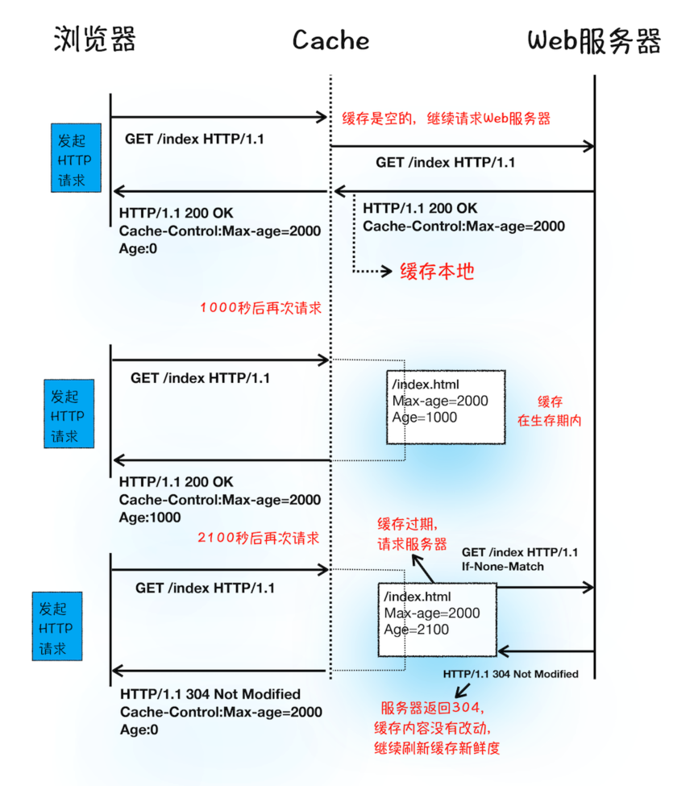

## HTTP请求流程

### 浏览器端
#### 1. 构建请求
首先，浏览器构建请求行信息（如下所示），构建好后，浏览器准备发起网络请求。
```
GET /index.html HTTP1.1
```

#### 2. 查找缓存
在真正发起网络请求之前，浏览器会先在浏览器缓存中查询是否有要请求的文件。其中，浏览器缓存是一种在本地保存资源副本，以供下次请求时直接使用的技术。

#### 3. 准备 IP 地址和端口


* 浏览器会请求 DNS 返回域名对应的 IP。
* 浏览器还提供了DNS 数据缓存服务，如果某个域名已经解析过了，那么浏览器会缓存解析的结果，以供下次查询时直接使用，这样也会减少一次网络请求。
* 拿到 IP 之后，接下来就需要获取端口号了。通常情况下，如果 URL 没有特别指明端口号，那么 HTTP 协议默认是 80 端口。


#### 4. 等待TCP队列
chrome 有个机制，同一个域名同时最多只能建立 6 个 TCP 连接，如果在同一个域名下同时有 10 个请求发生，那么其中 4 个请求会进入排队等待状态，直至进行中的请求完成

如果当前请求数量少于 6，会直接进入下一步，建立 TCP 连接

#### 5. 建立 TCP 连接
排队等待结束之后简历TCP连接

#### 6. 发送 HTTP 请求
一旦建立了 TCP 连接，浏览器就可以和服务器进行通信了。而 HTTP 中的数据正是在这个通信过程中传输的。


### 服务端

#### 1. 返回请求


#### 2. 断开连接

通常情况下，一旦服务器向客户端返回了请求数据，它就要关闭 TCP 连接。不过如果浏览器或者服务器在其头信息中加入了

```
Connection:Keep-Alive 
```
那么 TCP 连接在发送后将仍然保持打开状态，这样浏览器就可以继续通过同一个 TCP 连接发送请求

#### 3. 重定向


---

### 浏览器缓存处理过程


当服务器返回HTTP 响应头给浏览器时，浏览器是**通过响应头中的 Cache-Control 字段来设置是否缓存该资源**。通常，我们还需要为这个资源设置一个缓存过期时长，而这个时长是通过 Cache-Control 中的**Max-age** 参数来设置的，比如上图设置的缓存过期时间是 2000 秒

---
总结HTTP完整流程


HTTP请求包含以下八个阶段
+ 构建请求
+ 查找缓存
+ 准备 IP 和端口
+ 等待 TCP 队列
+ 建立 TCP 连接
+ 发起 HTTP 请求
+ 服务器处理请求
+ 服务器返回请求和断开连接