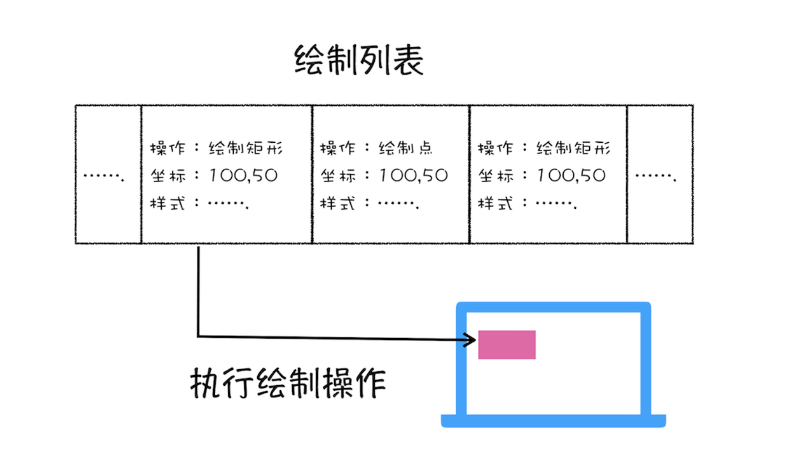
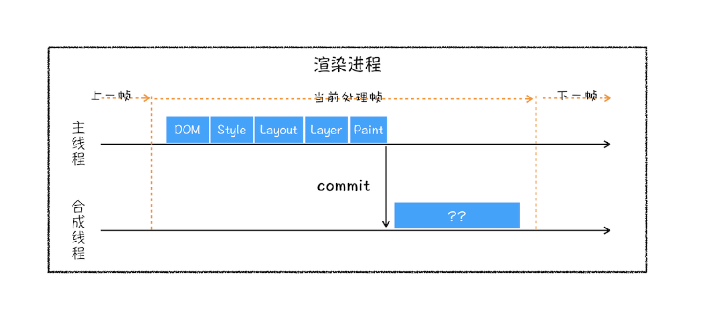
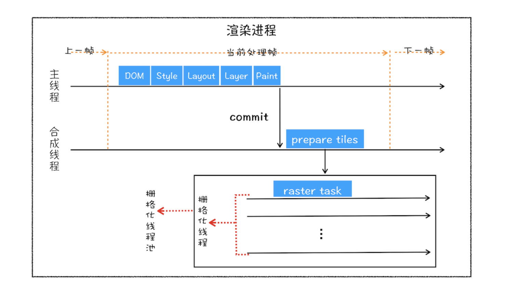
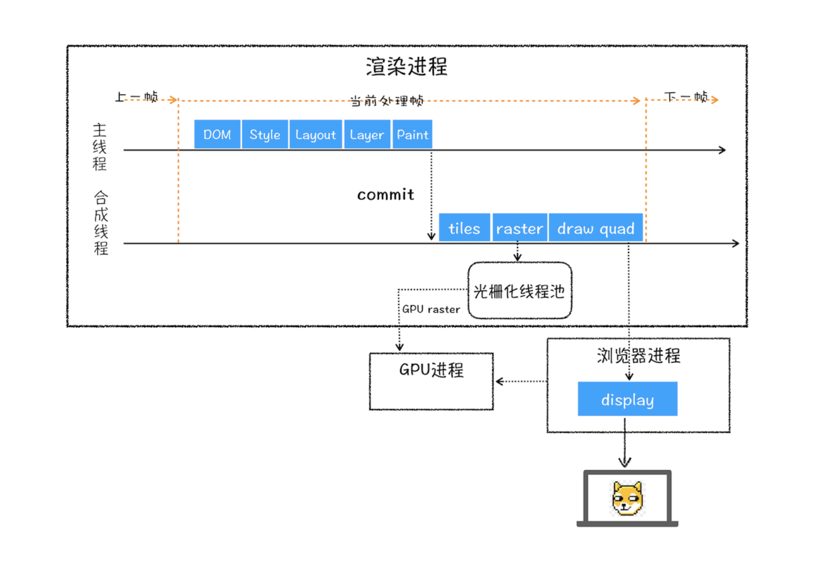

## 渲染流程

#### 1. 构建DOM树
浏览器无法直接理解和使用 HTML，所以需要将HTML 转换为浏览器能够理解的结构—DOM 树

#### 2. 样式计算（Recalculate Style）
 1. **把 CSS 转换为浏览器能够理解的结构**
 当渲染引擎接收到 CSS 文本时，会执行一个转换操作，将 CSS 文本转换为浏览器可以理解的结构——styleSheets

 2. **转换样式表中的属性值，使其标准化**
 如 2em、blue、bold，这些类型数值不容易被渲染引擎理解，所以**需要将所有值转换为渲染引擎容易理解的、标准化的计算值**
 

 3. **计算出 DOM 树中每个节点的具体样式**
    + **CSS 继承**。CSS 继承就是每个 DOM 节点都包含有父节点的样式。
    + **层叠**是 CSS 的一个基本特征，它是一个定义了如何合并来自多个源的属性值的算法。它在 CSS 处于核心地位，CSS 的全称“层叠样式表”正是强调了这一点

#### 3. 布局阶段
现在，我们有 DOM 树和 DOM 树中元素的样式，但这还不足以显示页面，因为我们还不知道 DOM 元素的几何位置信息。那么接下来就需要**计算出 DOM 树中可见元素的几何位置，我们把这个计算过程叫做布局**
  + **创建布局树**
      为了构建布局树，浏览器大体上完成了下面这些工作
    + 遍历 DOM 树中的所有可见节点，并把这些节点加到布局中；
    + 而不可见的节点会被布局树忽略掉，如 head 标签下面的全部内容，再比如body.p.span 这个元素，因为它的属性包含 dispaly:none，所以这个元素也没有被包进布局树。

  + **布局计算**  
    计算布局树节点的坐标位置

#### 4. 分层
渲染引擎还需要为特定的节点生成专用的图层，并生成一棵对应的图层树
渲染引擎给页面分了很多图层，这些图层按照一定顺序叠加在一起，就形成了最终的页面
并不是布局树的每个节点都包含一个图层，如果一个节点没有对应的层，那么这个节点就从属于父节点的图层，不管怎样，最终每一个节点都会直接或者间接地从属于一个层
满足一下条件就会为节点单独创建一个层：
  + 拥有层叠上下文属性的元素会被提升为单独的一层
    如 opacity、z-index、position、filter .....
  + 需要剪裁（clip）的地方也会被创建为图层
    ```
    如: 
    <div>
      超长文本...............
    <div>

    正常情况下文本和div是同一图层
    如果文本超出被div 裁剪, 就会为文本单独创建一个图层
    如果出现滚动条,滚动条也会单独创建一个图层
    ```

#### 5. 图层绘制
渲染引擎实现图层的绘制,会把一个图层的绘制拆分成很多小的**绘制指令**，然后再把这些指令按照顺序组成一个待绘制列表


#### 6. 栅格化（raster）操作
绘制列表只是用来记录绘制顺序和绘制指令的列表，而实际上绘制操作是由渲染引擎中的合成线程来完成的



**合成线程会将图层划分为图块（tile）:**
  然后**合成线程会按照视口附近的图块来优先生成位图，实际生成位图的操作是由栅格化来执行的。所谓栅格化，是指将图块转换为位图**。而图块是栅格化执行的最小单位。渲染进程维护了一个栅格化的线程池，所有的图块栅格化都是在线程池内执行的

  

  栅格化过程都会使用 GPU 来加速生成，使用 GPU 生成位图的过程叫快速栅格化，或者 GPU 栅格化，生成的位图被保存在 GPU 内存中

  GPU 操作是运行在 GPU 进程中，如果栅格化操作使用了 GPU，那么最终生成位图的操作是在 GPU 中完成的，这就涉及到了跨进程操作

#### 7. 合成和显示
一旦所有图块都被光栅化，合成线程就会生成一个绘制图块的命令——“DrawQuad”，然后将该命令提交给浏览器进程

浏览器进程里面有一个叫 viz 的组件，用来接收合成线程发过来的 DrawQuad 命令，然后根据 DrawQuad 命令，将其页面内容绘制到内存中，最后再将内存显示在屏幕上。

---

### 总结
完整的渲染流水线流程:
1. 渲染进程将 HTML 内容转换为能够读懂的DOM 树结构。
2. 渲染引擎将 CSS 样式表转化为浏览器可以理解的styleSheets，计算出 DOM 节点的样式。
3. 创建布局树，并计算元素的布局信息。
4. 对布局树进行分层，并生成分层树。
5. 为每个图层生成绘制列表，并将其提交到合成线程。
6. 合成线程将图层分成图块，并在光栅化线程池中将图块转换成位图。
7. 合成线程发送绘制图块命令DrawQuad给浏览器进程。
8. 浏览器进程根据 DrawQuad 消息生成页面，并显示到显示器上。相关概念




---

### 补充
#### 1. 更新了元素的几何属性（重排）
如改变元素的宽度、高度等，那么浏览器会触发重新布局，解析之后的一系列子阶段，这个过程就叫**重排**


#### 2. 更新元素的绘制属性（重绘）
如改变元素的宽度、高度等，那么浏览器会触发重新布局，解析之后的一系列子阶段，这个过程就叫重排


如果修改了元素的背景颜色，那么布局阶段将不会被执行，因为并没有引起几何位置的变换，所以就直接进入了绘制阶段，然后执行之后的一系列子阶段，这个过程就叫**重绘**

相较于重排操作，**重绘省去了布局和分层阶段，所以执行效率会比重排操作要高一些**

#### 3. 直接合成阶段
如果你更改一个既不要布局也不要绘制的属性，会发生什么变化呢？渲染引擎将跳过布局和绘制，只执行后续的合成操作，我们把这个过程叫做**合成**


**相对于重绘和重排，合成能大大提升绘制效率**