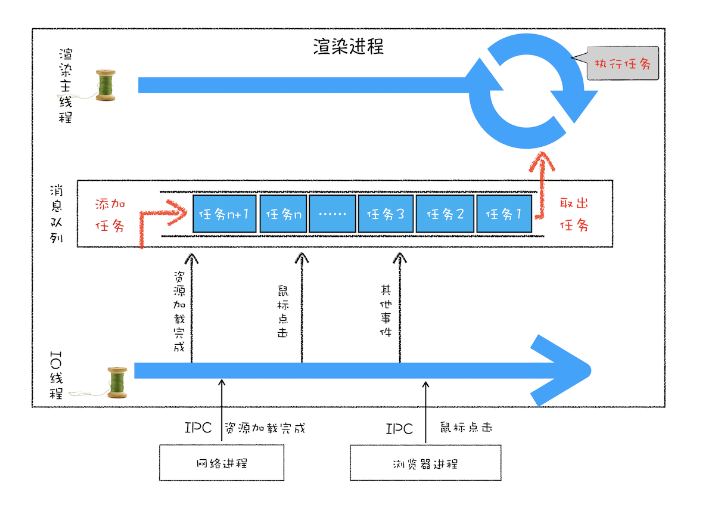

## 消息队列和事件循环

**渲染进程专门有一个 IO 线程用来接收其他进程传进来的消息**

**消息队列**是一种数据结构，可以存放要执行的任务。它符合队列“先进先出”的特点，也就是说要添加任务的话，添加到队列的尾部；要取出任务的话，从队列头部去取。

#### 消息队列中的任务类型

这里面包含了很多内部消息类型，如输入事件（鼠标滚动、点击、移动）、微任务、文件读写、WebSocket、JavaScript 定时器等等。
除此之外，消息队列中还包含了很多与页面相关的事件，如 JavaScript 执行、解析DOM、样式计算、布局计算、CSS 动画等。
以上这些事件都是在主线程中执行的，所以在编写 Web 应用时，你还需要衡量这些事件所占用的时长，并想办法解决单个任务占用主线程过久的问题

#### 如何安全退出

当页面主线程执行完成之后，又该如何保证页面主线程能够安全退出呢？Chrome 是这样解决的，确定要退出当前页面时，页面主线程会设置一个退出标志的变量，在每次执行完一个任务时，判断是否有设置退出标志

#### 页面使用单线程的缺点

**第一个问题是如何处理高优先级的任务**
比如一个典型的场景是监控 DOM 节点的变化情况,如果每次发生变化的时候，都直接调用相应的 JavaScript 接口，那么这个当前的任务执行时间会被拉长，从而导致**执行效率的下降**

如果将这些 DOM 变化做成异步的消息事件，添加到消息队列的尾部，那么又会影响到监控的实时性，因为在添加到消息队列的过程中，可能前面就有很多任务在排队了

这也就是说，如果 DOM 发生变化，采用同步通知的方式，会影响当前任务的**执行效率**；如果采用异步方式，又会影响到**监控的实时性**。

针对这种情况，微任务就应用而生了

通常我们把消息队列中的任务称为**宏任务**，每个宏任务中都包含了一个**微任务队列**，在执行宏任务的过程中，如果 DOM 有变化，那么就会将该变化添加到微任务列表中，这样就不会影响到宏任务的继续执行，因此也就解决了执行效率的问题。

等宏任务中的主要功能都直接完成之后，这时候，渲染引擎并不着急去执行下一个宏任务，而是执行当前宏任务中的微任务，因为 DOM 变化的事件都保存在这些微任务队列中，这样也就解决了实时性问题

**第二个是如何解决单个任务执行时长过久的问题**
因为所有的任务都是在单线程中执行的，所以每次只能执行一个任务，而其他任务就都处于等待状态。如果其中一个任务执行时间过久，那么下一个任务就要等待很长时间