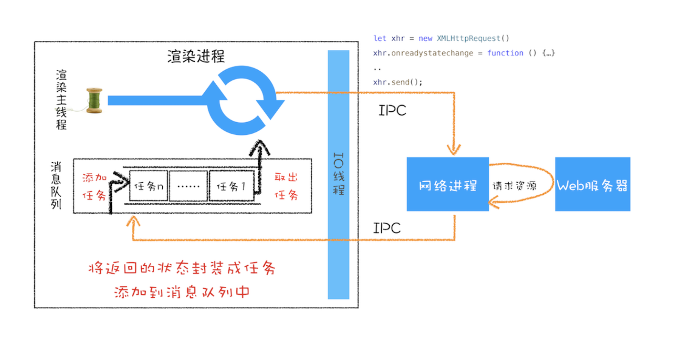

## XMLHttpRequest是如何实现
#### 回调函数 VS 系统调用栈
将一个函数作为参数传递给另外一个函数，那作为参数的这个函数就是**回调函数**
在主体函数执行之前调用回调函数,这个回调过程会成为**同步回调**
```js
  function callBack(cb) {
    cb()
  }
```
回调函数在主函数外部执行的过程称为**异步回调**
```js
  function callBack(cb) {
    setTimeout(cb, 1000)
  }
```

#### XMLHttpRequest 运作机制


1. **创建 XMLHttpRequest 对象**
  JavaScript 会创建一个XMLHttpRequest 对象xhr，用来执行实际的网络请求操作

2. **为 xhr 对象注册回调函数**
  因为网络请求比较耗时，所以要注册回调函数，这样后台任务执行完成之后就会通过调用回调函数来告诉其执行结果
  **XMLHttpRequest** 的回调函数主要有下面几种:
  **ontimeout**: 用来监控超时请求，如果后台请求超时了，该函数会被调用
  **onerror**: 用来监控出错信息，如果后台请求出错了，该函数会被调用
  **onreadystatechange**: 用来监控后台请求过程中的状态，比如可以监控到 HTTP 头加载完成的消息、HTTP 响应体消息以及数据加载完成的消息等
3. **配置基础的请求信息**
```js
  xhr.responseType = "text"
```
4. **发送请求**
